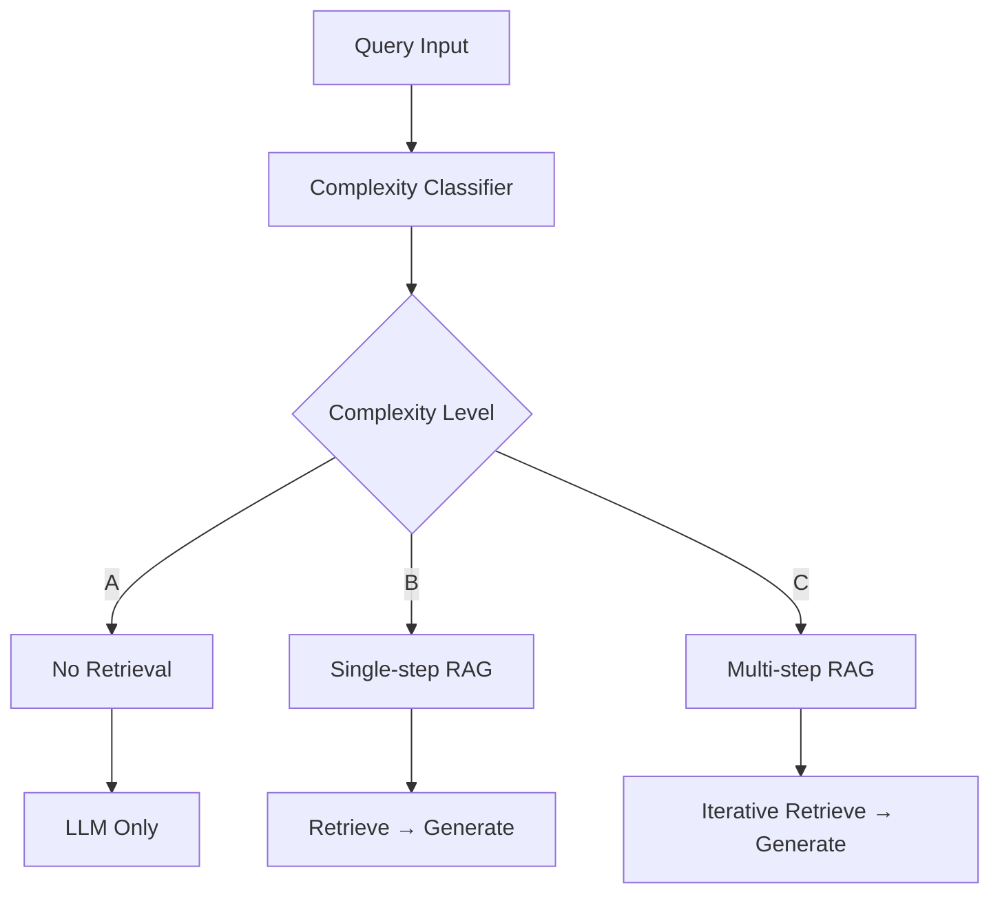

# Adaptive-RAG 논문과 LangGraph 구현 비교 분석

## 개요

본 문서는 "Adaptive-RAG: Learning to Adapt Retrieval-Augmented Large Language Models through Question Complexity" 논문의 이론적 기반과 LangGraph를 사용한 실제 구현 사이의 관계를 분석합니다.

## 1. 논문의 핵심 이론

### 1.1 핵심 아이디어

Adaptive-RAG는 질의의 복잡도에 따라 최적의 RAG 전략을 동적으로 선택하는 프레임워크입니다.

**기본 전제:**
- 실제 환경에서 모든 질의가 동일한 복잡도를 갖지 않음
- 단순한 질의에 복잡한 처리는 비효율적
- 복잡한 질의에 단순한 처리는 부정확함

### 1.2 3가지 RAG 전략



1. **No Retrieval (A)**: LLM의 파라미터 지식만 사용
   - 간단하고 직관적인 질의 (예: "파리는 어느 나라의 수도인가?")
   - 가장 효율적이지만 외부 지식 필요 시 한계

2. **Single-step RAG (B)**: 한 번의 검색 + 생성
   - 중간 복잡도의 질의
   - 외부 문서 하나로 답변 가능한 경우

3. **Multi-step RAG (C)**: 반복적 검색 + 생성
   - 복잡한 다단계 추론 필요
   - 여러 문서의 정보 종합이 필요한 경우

### 1.3 Query Complexity Classifier

**구조:**
- T5-Large 모델 기반
- 3클래스 분류: A, B, C
- 자동 라벨링 전략 사용

**훈련 데이터 생성 방법:**
1. **모델 예측 결과 기반**: 어떤 전략이 올바른 답을 생성했는지로 라벨 결정
2. **데이터셋 편향 활용**: single-hop 데이터셋 → B, multi-hop 데이터셋 → C

## 2. LangGraph 구현 분석

### 2.1 구현 아키텍처

LangGraph 구현은 논문의 이론적 프레임워크를 실제 동작하는 시스템으로 구현했습니다.

```python
# 핵심 상태 정의
class GraphState(TypedDict):
    question: str
    generation: str
    documents: List[str]
```

### 2.2 라우팅 시스템

**논문의 Classifier vs LangGraph의 Router:**

```python
# LangGraph의 RouteQuery
class RouteQuery(BaseModel):
    datasource: Literal["vectorstore", "web_search"] = Field(
        description="Given a user question choose to route it to web search or a vectorstore."
    )
```

**매핑 관계:**
- 논문의 A (No Retrieval) → 부분적으로 구현 (단순 질의는 vectorstore로 라우팅)
- 논문의 B (Single-step) → LangGraph의 vectorstore 경로
- 논문의 C (Multi-step) → LangGraph의 self-corrective 메커니즘

### 2.3 품질 보장 메커니즘

LangGraph는 논문보다 더 정교한 품질 검증 시스템을 구현:

```python
# 1. 검색 문서 관련성 평가
class GradeDocuments(BaseModel):
    binary_score: str = Field(description="Documents are relevant to the question, 'yes' or 'no'")

# 2. 환각 검증
class GradeHallucinations(BaseModel):
    binary_score: str = Field(description="Answer is grounded in the facts, 'yes' or 'no'")

# 3. 답변 품질 평가
class GradeAnswer(BaseModel):
    binary_score: str = Field(description="Answer addresses the question, 'yes' or 'no'")
```

## 3. 논문 이론의 실제 적용 분석

### 3.1 이론적 프레임워크의 구현

| 논문 개념 | LangGraph 구현 | 구현 방식 |
|----------|---------------|----------|
| Complexity Classifier | RouteQuery + LLM | 구조화된 출력으로 이진 분류 |
| No Retrieval | 부분 구현 | 간단한 질의도 vectorstore 사용 |
| Single-step RAG | retrieve → generate | 직접적 구현 |
| Multi-step RAG | self-corrective loop | 조건부 반복으로 구현 |
| Quality Control | Multiple Graders | 다단계 검증 시스템 |

### 3.2 워크플로 구현 비교

**논문의 이론적 워크플로:**
```
Query → Classifier → Strategy Selection → Execution → Result
```

**LangGraph의 실제 구현:**
```python
workflow = StateGraph(GraphState)
workflow.add_conditional_edges(
    START,
    route_question,  # 논문의 Classifier 역할
    {
        "web_search": "web_search",
        "vectorstore": "retrieve",
    },
)
# 추가 검증 단계들...
```

### 3.3 주요 차이점과 개선사항

**LangGraph의 개선점:**

1. **더 정교한 품질 관리**
   - 논문: 단순 성능 기반 분류
   - LangGraph: 다단계 검증 (관련성, 환각, 답변 품질)

2. **실시간 적응성**
   - 논문: 사전 훈련된 분류기
   - LangGraph: 실행 중 동적 평가

3. **오류 복구 메커니즘**
   - 논문: 언급 없음
   - LangGraph: Query rewriting, 재시도 로직

**논문의 고유 장점:**

1. **체계적인 이론적 기반**
   - 3가지 전략의 명확한 구분
   - 성능-효율성 트레이드오프 분석

2. **자동 라벨링 방법론**
   - 수동 라벨링 없이 훈련 데이터 생성
   - 다양한 데이터셋에서 검증

## 4. 성능 및 효율성 분석

### 4.1 논문의 실험 결과

**주요 성과:**
- F1 스코어 향상: 단순 접근법 대비 5-15% 개선
- 효율성 향상: Multi-step 대비 30-50% 시간 단축
- 모든 LLM 크기에서 일관된 성능

**성능 매트릭스:**
```
Method              F1    Time/Query  Efficiency
No Retrieval       21.12    0.11s     Highest
Single-step        44.31    1.00s     Medium  
Multi-step         48.85    8.81s     Lowest
Adaptive-RAG       46.94    3.60s     Balanced
```

### 4.2 LangGraph 구현의 실제 동작

**실행 예시 분석:**

1. **간단한 질의** ("What are the types of agent memory?")
   ```
   ---ROUTE QUESTION---
   ---ROUTE QUESTION TO RAG---
   ---RETRIEVE---
   ---CHECK DOCUMENT RELEVANCE---
   ---GENERATE---
   ```

2. **복잡한 질의** (최신 정보 필요)
   ```
   ---ROUTE QUESTION---
   ---ROUTE QUESTION TO WEB SEARCH---
   ---WEB SEARCH---
   ---GENERATE---
   ```

## 5. 실제 사용 시 고려사항

### 5.1 구현 복잡도

**논문 접근법:**
- 분류기 훈련 필요
- 3가지 전략 모두 구현 필요
- 데이터셋 편향 고려 필요

**LangGraph 접근법:**
- 즉시 사용 가능한 구현
- 기존 LLM API 활용
- 점진적 개선 가능

### 5.2 확장성과 유지보수

**논문의 장점:**
- 명확한 이론적 기반
- 다양한 도메인 적용 가능
- 성능 예측 가능

**LangGraph의 장점:**
- 모듈화된 구조
- 실시간 디버깅 가능
- 워크플로 시각화

## 6. 결론 및 향후 발전 방향

### 6.1 이론과 구현의 시너지

논문의 Adaptive-RAG와 LangGraph 구현은 상호 보완적인 관계를 보입니다:

- **논문**: 체계적인 이론적 기반과 성능 검증
- **LangGraph**: 실용적인 구현과 운영 경험

### 6.2 향후 개선 방향

1. **분류기 정교화**
   - 논문의 3단계 분류를 LangGraph에 통합
   - 더 세밀한 복잡도 구분

2. **하이브리드 접근법**
   - 사전 훈련된 분류기 + 실시간 평가
   - 논문의 이론 + LangGraph의 검증 메커니즘

3. **도메인 특화**
   - 특정 분야별 최적화
   - 사용자별 학습 적응

### 6.3 실무 적용 권장사항

1. **단계적 구현**
   - LangGraph 기본 구현으로 시작
   - 논문의 분류기 점진적 통합

2. **성능 모니터링**
   - 효율성과 정확성 지속 측정
   - 사용 패턴 기반 최적화

3. **사용자 피드백 활용**
   - 질의 복잡도 인간 평가 수집
   - 분류기 지속 개선

이러한 분석을 통해 Adaptive-RAG의 이론적 기반이 LangGraph 구현에서 어떻게 실현되고 있는지, 그리고 두 접근법의 상호 보완적 특성을 확인할 수 있습니다.