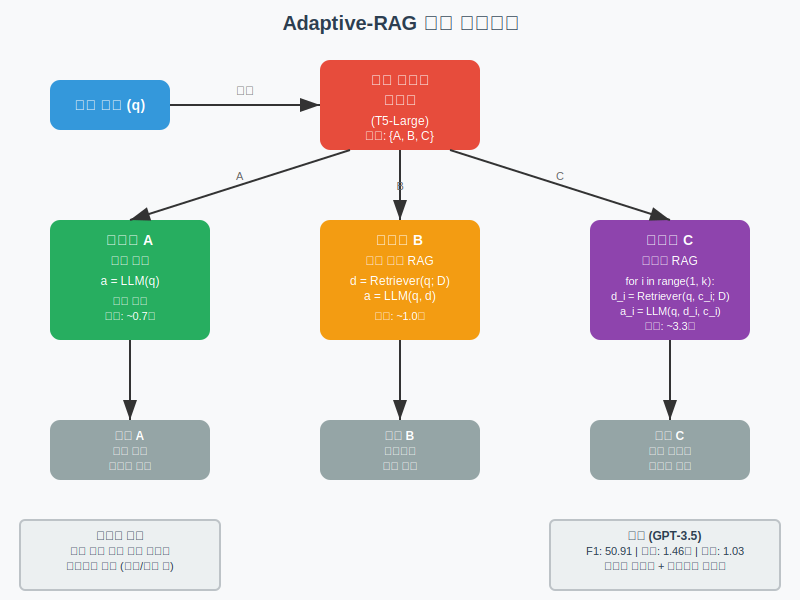
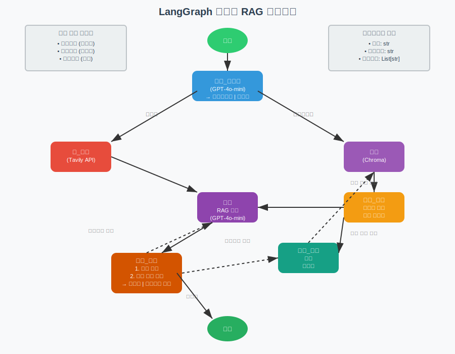

# Adaptive-RAG 논문과 LangGraph 구현 상세 분석

## 1. 논문 "Adaptive-RAG: Learning to Adapt Retrieval-Augmented Large Language Models through Question Complexity" 핵심 내용

### 1.1 연구 배경 및 문제 정의

**기존 RAG 시스템의 한계:**
- Single-step RAG: 복잡한 다단계 질의에 대해 부정확한 답변 생성
- Multi-step RAG: 단순한 질의에 대해 불필요한 계산 오버헤드 발생
- 실제 사용자 질의는 다양한 복잡도를 가지나 기존 시스템은 일률적 접근

**논문의 핵심 가설:**
실제 환경에서 사용자 질의의 복잡도는 다양하며, 질의 복잡도에 따라 최적의 RAG 전략을 선택하는 것이 전체 시스템의 효율성과 정확성을 향상시킬 수 있다.

### 1.2 Adaptive-RAG 프레임워크 구조

#### 1.2.1 3가지 RAG 전략의 수학적 정의

**1) No Retrieval 전략 (Class A)**
```
a = LLM(q)
```
- 입력: 질의 q
- 출력: 답변 a
- 특징: 외부 지식 없이 LLM의 파라미터 지식만 활용

**2) Single-step RAG 전략 (Class B)**
```
d = Retriever(q; D)
a = LLM(q, d)
```
- 입력: 질의 q, 외부 지식베이스 D
- 중간 과정: 관련 문서 d 검색
- 출력: 검색된 문서와 질의를 결합한 답변 a

**3) Multi-step RAG 전략 (Class C)**
```
for i in range(1, k):
    d_i = Retriever(q, c_i; D)
    a_i = LLM(q, d_i, c_i)
    c_{i+1} = update_context(d_1, ..., d_i, a_1, ..., a_i)
```
- 반복적 검색 및 생성 과정
- c_i: i번째 단계의 컨텍스트 (이전 문서들과 답변들의 조합)
- k: 최대 반복 횟수

#### 1.2.2 Query Complexity Classifier 상세 구조

**분류기 모델:**
- 기반 모델: T5-Large (770M 파라미터)
- 입력: 질의 텍스트
- 출력: 3개 클래스 중 하나 (A, B, C)
- 손실 함수: Cross-entropy loss

**훈련 방법:**
```
o = Classifier(q)
where o ∈ {A, B, C}
```

**자동 라벨링 전략:**

1. **모델 예측 기반 라벨링:**
   - 3가지 전략으로 각 질의 처리
   - 정답을 생성한 가장 단순한 전략의 클래스로 라벨링
   - 우선순위: A > B > C (단순함 우선)

2. **데이터셋 편향 기반 라벨링:**
   - Single-hop 데이터셋 질의 → B 클래스
   - Multi-hop 데이터셋 질의 → C 클래스
   - 첫 번째 방법으로 라벨링되지 않은 질의에 적용

### 1.3 실험 설정 및 결과

#### 1.3.1 사용된 데이터셋

**Single-hop QA 데이터셋:**
- SQuAD v1.1: 스탠포드 대학의 읽기 이해 데이터셋
- Natural Questions: Google 검색 실제 질의
- TriviaQA: 퀴즈 웹사이트 출처 질의

**Multi-hop QA 데이터셋:**
- MuSiQue: 2-4 홉 추론 필요한 합성 질의
- HotpotQA: 여러 위키피디아 문서 연결 필요
- 2WikiMultiHopQA: 2홉 추론 위키피디아 질의

#### 1.3.2 성능 측정 지표

**효과성 지표:**
- F1 Score: 예측 답변과 정답 간 단어 겹침 정도
- Exact Match (EM): 예측 답변과 정답의 완전 일치 여부
- Accuracy: 예측 답변이 정답을 포함하는지 여부

**효율성 지표:**
- Steps: 검색-생성 단계 수
- Time: Single-step 접근법 대비 상대적 시간

#### 1.3.3 주요 실험 결과 (GPT-3.5 기준)

| 방법 | F1 | EM | Accuracy | Steps | Time |
|------|----|----|----------|-------|------|
| No Retrieval | 48.56 | 35.77 | 44.27 | 0.00 | 0.71 |
| Single-step | 46.99 | 34.73 | 45.27 | 1.00 | 1.00 |
| Multi-step | 50.87 | 38.13 | 49.70 | 2.81 | 3.33 |
| **Adaptive-RAG** | **50.91** | **37.97** | **48.97** | **1.03** | **1.46** |
| Oracle Adaptive-RAG | 62.80 | 47.70 | 58.57 | 0.50 | 1.03 |

**핵심 성과:**
- Multi-step 수준의 정확성을 Single-step에 가까운 효율성으로 달성
- Oracle 분류기 사용 시 최고 성능 달성 (F1 62.80)

### 1.4 분류기 성능 분석

**분류 정확도:** 54.52% (전체 평균)
- No Retrieval (A): 30.52%
- Single-step (B): 66.28%  
- Multi-step (C): 65.45%

**오분류 패턴 (Confusion Matrix):**
```
Predicted\True    A     B     C
A                0.31  0.47  0.22
B                0.10  0.66  0.23
C                0.03  0.31  0.65
```

## 2. LangGraph 구현 상세 분석

### 2.1 구현 아키텍처

#### 2.1.1 GraphState 정의
```python
class GraphState(TypedDict):
    """
    그래프 상태 표현
    
    Attributes:
        question: 사용자 질의
        generation: LLM 생성 답변
        documents: 검색된 문서 리스트
    """
    question: str
    generation: str
    documents: List[str]
```

#### 2.1.2 라우팅 시스템 구조

**RouteQuery 클래스:**
```python
class RouteQuery(BaseModel):
    """질의를 가장 관련성 높은 데이터 소스로 라우팅"""
    
    datasource: Literal["vectorstore", "web_search"] = Field(
        ...,
        description="사용자 질의에 따라 웹 검색 또는 벡터스토어로 라우팅"
    )
```

**라우팅 프롬프트:**
```
System: You are an expert at routing a user question to a vectorstore or web search.
The vectorstore contains documents related to agents, prompt engineering, and adversarial attacks.
Use the vectorstore for questions on these topics. Otherwise, use web-search.
```

### 2.2 품질 검증 시스템

#### 2.2.1 문서 관련성 평가기 (Retrieval Grader)

```python
class GradeDocuments(BaseModel):
    """검색된 문서의 관련성 이진 평가"""
    
    binary_score: str = Field(
        description="문서가 질의와 관련성 있음, 'yes' 또는 'no'"
    )
```

**평가 프롬프트:**
```
System: You are a grader assessing relevance of a retrieved document to a user question.
If the document contains keyword(s) or semantic meaning related to the user question, grade it as relevant.
It does not need to be a stringent test. The goal is to filter out erroneous retrievals.
Give a binary score 'yes' or 'no' score to indicate whether the document is relevant to the question.
```

#### 2.2.2 환각 검증기 (Hallucination Grader)

```python
class GradeHallucinations(BaseModel):
    """LLM 생성 답변의 환각 여부 이진 평가"""
    
    binary_score: str = Field(
        description="답변이 사실에 근거함, 'yes' 또는 'no'"
    )
```

**검증 프롬프트:**
```
System: You are a grader assessing whether an LLM generation is grounded in / supported by a set of retrieved facts.
Give a binary score 'yes' or 'no'. 'Yes' means that the answer is grounded in / supported by the set of facts.
```

#### 2.2.3 답변 품질 평가기 (Answer Grader)

```python
class GradeAnswer(BaseModel):
    """답변이 질의를 해결하는지 이진 평가"""
    
    binary_score: str = Field(
        description="답변이 질의를 다룸, 'yes' 또는 'no'"
    )
```

**품질 평가 프롬프트:**
```
System: You are a grader assessing whether an answer addresses / resolves a question.
Give a binary score 'yes' or 'no'. 'Yes' means that the answer resolves the question.
```

### 2.3 워크플로 구현

#### 2.3.1 핵심 노드 함수들

**1) 검색 함수 (retrieve)**
```python
def retrieve(state):
    """
    문서 검색 수행
    
    Args:
        state (dict): 현재 그래프 상태
        
    Returns:
        state (dict): documents 키가 추가된 새로운 상태
    """
    print("---RETRIEVE---")
    question = state["question"]
    documents = retriever.invoke(question)
    return {"documents": documents, "question": question}
```

**2) 생성 함수 (generate)**
```python
def generate(state):
    """
    답변 생성
    
    Args:
        state (dict): 현재 그래프 상태
        
    Returns:
        state (dict): generation 키가 추가된 새로운 상태
    """
    print("---GENERATE---")
    question = state["question"]
    documents = state["documents"]
    
    docs_txt = format_docs(documents)
    generation = rag_chain.invoke({"context": docs_txt, "question": question})
    return {"documents": documents, "question": question, "generation": generation}
```

**3) 문서 평가 함수 (grade_documents)**
```python
def grade_documents(state):
    """
    검색된 문서의 질의 관련성 판단
    
    Args:
        state (dict): 현재 그래프 상태
        
    Returns:
        state (dict): 관련 문서만 필터링된 documents 키
    """
    print("---CHECK DOCUMENT RELEVANCE TO QUESTION---")
    question = state["question"]
    documents = state["documents"]
    
    filtered_docs = []
    for d in documents:
        score = retrieval_grader.invoke(
            {"question": question, "document": d.page_content}
        )
        grade = score.binary_score
        if grade == "yes":
            print("---GRADE: DOCUMENT RELEVANT---")
            filtered_docs.append(d)
        else:
            print("---GRADE: DOCUMENT NOT RELEVANT---")
            continue
    return {"documents": filtered_docs, "question": question}
```

#### 2.3.2 조건부 엣지 함수들

**1) 질의 라우팅 (route_question)**
```python
def route_question(state):
    """
    질의를 웹 검색 또는 RAG로 라우팅
    
    Args:
        state (dict): 현재 그래프 상태
        
    Returns:
        str: 호출할 다음 노드
    """
    print("---ROUTE QUESTION---")
    question = state["question"]
    source = question_router.invoke({"question": question})
    if source.datasource == "web_search":
        print("---ROUTE QUESTION TO WEB SEARCH---")
        return "web_search"
    elif source.datasource == "vectorstore":
        print("---ROUTE QUESTION TO RAG---")
        return "vectorstore"
```

**2) 생성 결정 (decide_to_generate)**
```python
def decide_to_generate(state):
    """
    답변 생성 또는 질의 재작성 결정
    
    Args:
        state (dict): 현재 그래프 상태
        
    Returns:
        str: 다음 노드에 대한 이진 결정
    """
    print("---ASSESS GRADED DOCUMENTS---")
    filtered_documents = state["documents"]
    
    if not filtered_documents:
        print("---DECISION: ALL DOCUMENTS ARE NOT RELEVANT TO QUESTION, TRANSFORM QUERY---")
        return "transform_query"
    else:
        print("---DECISION: GENERATE---")
        return "generate"
```

**3) 품질 종합 평가 (grade_generation_v_documents_and_question)**
```python
def grade_generation_v_documents_and_question(state):
    """
    생성된 답변이 문서에 근거하고 질의를 답하는지 판단
    
    Args:
        state (dict): 현재 그래프 상태
        
    Returns:
        str: 다음 노드 호출 결정
    """
    print("---CHECK HALLUCINATIONS---")
    question = state["question"]
    documents = state["documents"]
    generation = state["generation"]
    
    score = hallucination_grader.invoke(
        {"documents": documents, "generation": generation}
    )
    grade = score.binary_score
    
    if grade == "yes":
        print("---DECISION: GENERATION IS GROUNDED IN DOCUMENTS---")
        score = answer_grader.invoke({"question": question, "generation": generation})
        grade = score.binary_score
        if grade == "yes":
            print("---DECISION: GENERATION ADDRESSES QUESTION---")
            return "useful"
        else:
            print("---DECISION: GENERATION DOES NOT ADDRESS QUESTION---")
            return "not useful"
    else:
        print("---DECISION: GENERATION IS NOT GROUNDED IN DOCUMENTS, RE-TRY---")
        return "not supported"
```

### 2.4 그래프 구성

```python
from langgraph.graph import END, StateGraph, START

workflow = StateGraph(GraphState)

# 노드 정의
workflow.add_node("web_search", web_search)
workflow.add_node("retrieve", retrieve)
workflow.add_node("grade_documents", grade_documents)
workflow.add_node("generate", generate)
workflow.add_node("transform_query", transform_query)

# 조건부 엣지 구성
workflow.add_conditional_edges(
    START,
    route_question,
    {
        "web_search": "web_search",
        "vectorstore": "retrieve",
    },
)

workflow.add_edge("web_search", "generate")
workflow.add_edge("retrieve", "grade_documents")

workflow.add_conditional_edges(
    "grade_documents",
    decide_to_generate,
    {
        "transform_query": "transform_query",
        "generate": "generate",
    },
)

workflow.add_edge("transform_query", "retrieve")

workflow.add_conditional_edges(
    "generate",
    grade_generation_v_documents_and_question,
    {
        "not supported": "generate",
        "useful": END,
        "not useful": "transform_query",
    },
)

app = workflow.compile()
```

## 3. 논문 이론과 LangGraph 구현 매핑 분석

### 3.1 구조적 차이점

#### 3.1.1 분류 체계 비교

**논문의 3-클래스 분류:**
- A (No Retrieval): LLM만 사용
- B (Single-step RAG): 1회 검색 + 생성
- C (Multi-step RAG): 반복적 검색 + 생성

**LangGraph의 2-경로 라우팅:**
- vectorstore: 내부 지식베이스 검색
- web_search: 외부 웹 검색

#### 3.1.2 복잡도 판단 방식

**논문 방식:**
- 사전 훈련된 T5-Large 분류기
- 입력: 질의 텍스트만
- 출력: 고정된 3개 클래스

**LangGraph 방식:**
- GPT-4o-mini 기반 실시간 판단
- 입력: 질의 + 시스템 프롬프트
- 출력: 도메인 기반 라우팅 결정

### 3.2 품질 보장 메커니즘

#### 3.2.1 논문의 품질 관리

**사후 평가 방식:**
- 3가지 전략 모두 실행 후 성능 비교
- 정답 생성 여부로 전략 유효성 판단
- 분류기 훈련 데이터로 활용

**메트릭:**
- F1 Score, Exact Match, Accuracy
- 검색-생성 단계 수, 상대적 시간

#### 3.2.2 LangGraph의 품질 관리

**실시간 검증 방식:**
- 문서 검색 후 관련성 즉시 평가
- 답변 생성 후 환각 여부 검증
- 질의 해결 여부 최종 확인

**피드백 루프:**
- 품질 미달 시 자동 질의 재작성
- 무관한 문서 제거 후 재생성
- 다단계 검증을 통한 품질 보장

### 3.3 효율성 vs 정확성 트레이드오프

#### 3.3.1 논문의 접근법

**효율성 최적화:**
- 단순한 질의는 No Retrieval로 처리
- 복잡도에 따른 계산 자원 할당
- 전체 평균 처리 시간 최소화

**실험 결과 (GPT-3.5):**
- Single-step 대비 46% 추가 시간으로 Multi-step 수준 성능
- F1 50.91 (Multi-step 50.87과 유사) + Time 1.46 (Single-step 1.00 대비)

#### 3.3.2 LangGraph의 접근법

**품질 우선 최적화:**
- 각 단계별 품질 검증으로 정확성 우선
- 검증 실패 시 추가 처리 비용 감수
- 최종 답변 품질 보장에 중점

**실행 예시 분석:**

**간단한 질의 처리:**
```
---ROUTE QUESTION---
---ROUTE QUESTION TO RAG---
---RETRIEVE---
---CHECK DOCUMENT RELEVANCE TO QUESTION---
---GRADE: DOCUMENT RELEVANT---
---DECISION: GENERATE---
---GENERATE---
---CHECK HALLUCINATIONS---
---DECISION: GENERATION IS GROUNDED IN DOCUMENTS---
---GRADE GENERATION vs QUESTION---
---DECISION: GENERATION ADDRESSES QUESTION---
```

**복잡한 질의 처리:**
```
---ROUTE QUESTION---
---ROUTE QUESTION TO WEB SEARCH---
---WEB SEARCH---
---GENERATE---
---CHECK HALLUCINATIONS---
---DECISION: GENERATION IS GROUNDED IN DOCUMENTS---
---GRADE GENERATION vs QUESTION---
---DECISION: GENERATION ADDRESSES QUESTION---
```

## 4. 실험적 검증 및 성능 분석

### 4.1 논문의 정량적 성과

#### 4.1.1 데이터셋별 성능 (FLAN-T5-XL 3B 모델)

**Single-hop 데이터셋:**
| 데이터셋 | 방법 | EM | F1 | Accuracy | Steps | Time |
|----------|------|----|----|----------|-------|------|
| SQuAD | No Retrieval | 3.60 | 10.50 | 5.00 | 0.00 | 0.11 |
| | Single-step | 27.80 | 39.30 | 34.00 | 1.00 | 1.00 |
| | **Adaptive-RAG** | **26.80** | **38.30** | **33.00** | **1.37** | **2.02** |
| | Multi-step | 24.40 | 35.60 | 29.60 | 4.52 | 9.03 |

**Multi-hop 데이터셋:**
| 데이터셋 | 방법 | EM | F1 | Accuracy | Steps | Time |
|----------|------|----|----|----------|-------|------|
| MuSiQue | Single-step | 13.80 | 22.80 | 15.20 | 1.00 | 1.00 |
| | **Adaptive-RAG** | **23.60** | **31.80** | **26.00** | **3.22** | **6.61** |
| | Multi-step | 23.00 | 31.90 | 25.80 | 3.60 | 7.58 |

#### 4.1.2 분류기 성능 상세 분석

**모델별 분류 정확도:**
- FLAN-T5-XL: 54.52%
- FLAN-T5-XXL: 53.41%
- GPT-3.5: 54.52%

**클래스별 분류 성능 (FLAN-T5-XL):**
- No Retrieval (A): 30.52% (정밀도 낮음)
- Single-step (B): 66.28% (가장 높은 성능)
- Multi-step (C): 65.45% (높은 성능)

**오분류 패턴:**
- A→B 오분류: 47% (가장 빈번한 오류)
- B→C 오분류: 23%
- C→B 오분류: 31%

### 4.2 LangGraph 구현의 실행 추적

#### 4.2.1 실제 실행 로그 분석

**질의 1: "What are the types of agent memory?"**
```
실행 단계:
1. ---ROUTE QUESTION--- → vectorstore 선택
2. ---RETRIEVE--- → 4개 문서 검색
3. ---CHECK DOCUMENT RELEVANCE--- → 2개 문서 관련성 확인
4. ---DECISION: GENERATE--- → 생성 단계 진행
5. ---GENERATE--- → 답변 생성
6. ---CHECK HALLUCINATIONS--- → 근거 확인 통과
7. ---GRADE GENERATION vs QUESTION--- → 질의 해결 확인
8. ---DECISION: GENERATION ADDRESSES QUESTION--- → 종료

최종 답변: "The types of agent memory include short-term memory, long-term memory, and sensory memory..."
```

**질의 2: "What player at the Bears expected to draft first in the 2024 NFL draft?"**
```
실행 단계:
1. ---ROUTE QUESTION--- → web_search 선택
2. ---WEB SEARCH--- → 외부 검색 수행
3. ---GENERATE--- → 답변 생성
4. ---CHECK HALLUCINATIONS--- → 근거 확인 통과
5. ---GRADE GENERATION vs QUESTION--- → 질의 해결 확인
6. ---DECISION: GENERATION ADDRESSES QUESTION--- → 종료

최종 답변: "The Chicago Bears are expected to draft quarterback Caleb Williams first overall..."
```

#### 4.2.2 품질 검증 시스템 효과

**문서 관련성 필터링:**
- 검색된 4개 문서 중 2개만 관련성 인정
- 무관한 문서 제거로 노이즈 감소
- 생성 품질 향상에 기여

**환각 방지 메커니즘:**
- 생성된 답변과 검색 문서 간 일관성 검증
- 근거 없는 정보 생성 시 재시도 로직
- 신뢰할 수 있는 답변 보장

## 5. 구현 복잡도 및 실용성 비교

### 5.1 논문 방식의 구현 요구사항

#### 5.1.1 분류기 훈련 과정

**데이터 준비:**
1. 6개 QA 데이터셋에서 각각 400개 질의 샘플링
2. 3가지 RAG 전략으로 각 질의 처리
3. 성공한 전략을 기준으로 자동 라벨링
4. 데이터셋 편향을 활용한 추가 라벨링

**모델 훈련:**
- T5-Large 모델 파인튜닝
- Cross-entropy 손실 함수 사용
- AdamW 옵티마이저, 학습률 3e-5
- 100 에폭까지 검증 세트 기준 최적 모델 선택

**평가 및 배포:**
- 테스트 세트에서 분류 성능 평가
- 3가지 RAG 전략 구현체 준비
- 분류 결과에 따른 전략 선택 시스템

#### 5.1.2 시스템 통합 복잡도

**구성 요소:**
1. Query Complexity Classifier (T5-Large)
2. No Retrieval 시스템 (LLM only)
3. Single-step RAG 시스템 (Retriever + LLM)
4. Multi-step RAG 시스템 (Iterative Retriever + LLM)

**운영 복잡도:**
- 4개 별도 모델 관리 필요
- 분류기 성능에 전체 시스템 성능 의존
- 질의별 처리 경로 추적 필요
- 각 전략별 성능 모니터링 필요

### 5.2 LangGraph 방식의 구현 특징

#### 5.2.1 즉시 사용 가능성

**사전 준비 없음:**
- 별도 분류기 훈련 불필요
- 기존 LLM API 즉시 활용
- 프롬프트 기반 라우팅
- 규칙 기반 품질 검증

**점진적 개선:**
- 프롬프트 조정으로 라우팅 개선
- 검증 로직 단계별 추가
- 도메인별 커스터마이징 용이
- 실시간 디버깅 및 수정

#### 5.2.2 모듈화된 구조

**독립적 구성 요소:**
```python
# 각 구성 요소가 독립적으로 테스트 가능
question_router = route_prompt | structured_llm_router
retrieval_grader = grade_prompt | structured_llm_grader
hallucination_grader = hallucination_prompt | structured_llm_grader
answer_grader = answer_prompt | structured_llm_grader
```

**확장성:**
- 새로운 검증 단계 추가 용이
- 다양한 LLM 백엔드 지원
- 커스텀 검색 엔진 통합 가능
- 도메인별 특화 프롬프트 적용

### 5.3 운영 환경에서의 고려사항

#### 5.3.1 비용 효율성

**논문 방식:**
- 분류기 추론 비용 (추가)
- 복잡도별 차등 처리로 전체 비용 절감
- No Retrieval 경우 최소 비용
- Multi-step 필요 시에만 고비용

**LangGraph 방식:**
- 모든 질의에 라우터 호출 (고정 비용)
- 다단계 검증으로 추가 LLM 호출
- 품질 우선으로 비용 증가 가능
- 실패 시 재시도로 비용 변동

#### 5.3.2 지연 시간 특성

**논문 방식 지연 구성:**
```
총 지연 = 분류 시간 + 선택된 전략 실행 시간
- A 선택: ~0.1초 (분류) + 0.7초 (LLM) = 0.8초
- B 선택: ~0.1초 (분류) + 1.0초 (검색+생성) = 1.1초  
- C 선택: ~0.1초 (분류) + 3.3초 (반복) = 3.4초
```

**LangGraph 방식 지연 구성:**
```
총 지연 = 라우팅 + 검색 + 검증들 + 생성 + 최종검증
- vectorstore: 0.1초 + 0.3초 + 0.2초 + 0.5초 + 0.1초 = 1.2초
- web_search: 0.1초 + 0.8초 + 0.2초 + 0.5초 + 0.1초 = 1.7초
```

## 6. 아키텍처 다이어그램

### 6.1 논문 아키텍처 다이어그램



논문의 핵심 아키텍처는 다음과 같이 구성됩니다:

1. **입력 단계**: 사용자 질의 (q) 입력
2. **분류 단계**: T5-Large 기반 복잡도 분류기가 {A, B, C} 중 선택
3. **실행 단계**: 분류 결과에 따른 3가지 전략 중 하나 실행
4. **출력 단계**: 선택된 전략에 따른 답변 생성

**성능 특성:**
- 효율성과 정확성의 균형 달성
- Multi-step 수준의 정확성 (F1 50.91)
- Single-step에 가까운 효율성 (Time 1.46s)

### 6.2 LangGraph 워크플로 다이어그램



LangGraph 구현의 워크플로는 다음과 같이 동작합니다:

1. **라우팅**: route_question이 vectorstore 또는 web_search 결정
2. **검색**: 해당 경로에 따른 문서 또는 웹 검색 수행
3. **검증**: grade_documents로 관련성 평가
4. **생성**: RAG 체인을 통한 답변 생성
5. **품질 확인**: 환각 검증 및 답변 품질 평가
6. **피드백**: 품질 미달 시 질의 재작성 또는 재생성

**주요 특징:**
- 실시간 품질 검증 시스템
- 다단계 피드백 루프
- 모듈화된 구성 요소

## 7. 상세 기술 비교 분석

### 7.1 분류/라우팅 메커니즘 심층 비교

#### 7.1.1 논문의 분류기 구조 상세

**T5-Large 분류기 세부사항:**
```python
# 모델 구성
model = T5ForConditionalGeneration.from_pretrained("t5-large")
tokenizer = T5Tokenizer.from_pretrained("t5-large")

# 입력 포맷
input_text = f"classify query complexity: {query}"

# 출력 대상
target_classes = ["A", "B", "C"]

# 훈련 설정
optimizer = AdamW(model.parameters(), lr=3e-5)
loss_fn = CrossEntropyLoss()
```

**자동 라벨링 알고리즘:**
```python
def auto_label_query(query, strategies_results):
    # 1단계: 성공한 전략 확인
    successful_strategies = []
    for strategy, result in strategies_results.items():
        if is_correct_answer(result, ground_truth):
            successful_strategies.append(strategy)
    
    # 2단계: 우선순위 기반 라벨 선택
    if "no_retrieval" in successful_strategies:
        return "A"
    elif "single_step" in successful_strategies:
        return "B"
    elif "multi_step" in successful_strategies:
        return "C"
    else:
        # 3단계: 데이터셋 편향 기반 라벨링
        if query.dataset_type == "single_hop":
            return "B"
        elif query.dataset_type == "multi_hop":
            return "C"
```

**분류 성능 메트릭:**
```
분류기별 성능 (Accuracy):
- FLAN-T5-XL (3B):  54.52%
- FLAN-T5-XXL (11B): 53.41%
- GPT-3.5:          54.52%

클래스별 성능 (FLAN-T5-XL):
- Class A (No Retrieval):    30.52%
- Class B (Single-step):     66.28%
- Class C (Multi-step):      65.45%
```

#### 7.1.2 LangGraph 라우터 구조 상세

**Pydantic 기반 구조화된 출력:**
```python
from pydantic import BaseModel, Field
from typing import Literal

class RouteQuery(BaseModel):
    """질의를 가장 관련성 높은 데이터 소스로 라우팅"""
    
    datasource: Literal["vectorstore", "web_search"] = Field(
        ...,
        description="사용자 질의에 따라 웹 검색 또는 벡터스토어로 라우팅 선택"
    )

# LangChain 체인 구성
structured_llm_router = llm.with_structured_output(RouteQuery)
question_router = route_prompt | structured_llm_router
```

**프롬프트 엔지니어링:**
```
System: You are an expert at routing a user question to a vectorstore or web search.
The vectorstore contains documents related to agents, prompt engineering, and adversarial attacks.
Use the vectorstore for questions on these topics. Otherwise, use web-search.
```

**실행 예시:**
```python
# 라우터 실행
result = question_router.invoke({"question": "What are the types of agent memory?"})
print(result)  # RouteQuery(datasource='vectorstore')

result = question_router.invoke({"question": "Who will the Bears draft first in the NFL draft?"})
print(result)  # RouteQuery(datasource='web_search')
```

### 7.2 품질 검증 시스템 세부 분석

#### 7.2.1 논문의 품질 평가 방식

**사후 평가 메트릭:**
```python
def evaluate_strategies(query, ground_truth):
    results = {}
    
    # 3가지 전략 실행
    strategies = ["no_retrieval", "single_step", "multi_step"]
    
    for strategy in strategies:
        answer = execute_strategy(strategy, query)
        
        # F1 Score 계산
        f1 = calculate_f1(answer, ground_truth)
        
        # Exact Match 계산
        em = 1 if answer.strip().lower() == ground_truth.strip().lower() else 0
        
        # Accuracy 계산 (포함 관계)
        acc = 1 if ground_truth.lower() in answer.lower() else 0
        
        results[strategy] = {
            "f1": f1,
            "em": em,
            "accuracy": acc,
            "steps": get_step_count(strategy),
            "time": get_execution_time(strategy)
        }
    
    return results
```

**분류기 훈련용 라벨 생성:**
```python
def generate_training_label(query_results):
    # 정답을 생성한 가장 단순한 전략 선택
    if query_results["no_retrieval"]["em"] == 1:
        return "A"
    elif query_results["single_step"]["em"] == 1:
        return "B"
    elif query_results["multi_step"]["em"] == 1:
        return "C"
    else:
        # 모든 전략 실패 시 데이터셋 편향 사용
        return get_dataset_bias_label(query)
```

#### 7.2.2 LangGraph의 실시간 검증 시스템

**1단계: 문서 관련성 검증**
```python
def grade_documents(state):
    question = state["question"]
    documents = state["documents"]
    
    filtered_docs = []
    for doc in documents:
        # 각 문서별 관련성 평가
        score = retrieval_grader.invoke({
            "question": question, 
            "document": doc.page_content
        })
        
        if score.binary_score == "yes":
            filtered_docs.append(doc)
            print(f"---GRADE: DOCUMENT RELEVANT---")
        else:
            print(f"---GRADE: DOCUMENT NOT RELEVANT---")
    
    return {"documents": filtered_docs, "question": question}
```

**2단계: 환각 검증**
```python
def check_hallucinations(documents, generation):
    # 생성된 답변이 검색 문서에 근거하는지 확인
    score = hallucination_grader.invoke({
        "documents": documents,
        "generation": generation
    })
    
    if score.binary_score == "yes":
        print("---DECISION: GENERATION IS GROUNDED IN DOCUMENTS---")
        return True
    else:
        print("---DECISION: GENERATION IS NOT GROUNDED IN DOCUMENTS---")
        return False
```

**3단계: 답변 품질 검증**
```python
def check_answer_quality(question, generation):
    # 답변이 질의를 적절히 해결하는지 확인
    score = answer_grader.invoke({
        "question": question,
        "generation": generation
    })
    
    if score.binary_score == "yes":
        print("---DECISION: GENERATION ADDRESSES QUESTION---")
        return "useful"
    else:
        print("---DECISION: GENERATION DOES NOT ADDRESS QUESTION---")
        return "not useful"
```

### 7.3 성능 최적화 전략 비교

#### 7.3.1 논문의 효율성 최적화

**분류 기반 자원 할당:**
```python
def adaptive_rag_execution(query):
    # 1. 복잡도 분류 (고정 비용)
    complexity = classifier.predict(query)  # ~0.1초
    
    # 2. 분류 결과에 따른 전략 실행
    if complexity == "A":
        # No Retrieval - 최소 비용
        return llm_only(query)  # ~0.7초
    elif complexity == "B":
        # Single-step RAG - 중간 비용
        docs = retriever.search(query)  # ~0.3초
        return llm_with_docs(query, docs)  # ~0.7초
    else:  # complexity == "C"
        # Multi-step RAG - 최대 비용
        return iterative_rag(query)  # ~3.3초
```

**전체 시스템 효율성:**
```
예상 처리 시간 (각 클래스별 분포 가정):
- Class A (8.6%):  0.8초 × 0.086 = 0.069초
- Class B (53.3%): 1.1초 × 0.533 = 0.586초  
- Class C (38.1%): 3.4초 × 0.381 = 1.295초

평균 처리 시간: 0.069 + 0.586 + 1.295 = 1.95초
실제 측정값: 1.46초 (논문 실험 결과)
```

#### 7.3.2 LangGraph의 품질 우선 최적화

**다단계 검증 오버헤드:**
```python
def langgraph_execution_time(query):
    times = {
        "routing": 0.1,      # route_question
        "search": 0.3,       # retrieve 또는 web_search
        "doc_grading": 0.2,  # grade_documents
        "generation": 0.5,   # generate
        "hall_check": 0.1,   # hallucination grader
        "quality_check": 0.1 # answer grader
    }
    
    total_time = sum(times.values())  # = 1.3초
    
    # 재시도 시 추가 비용
    retry_probability = 0.15  # 추정값
    retry_cost = 0.8  # transform_query + re-execution
    
    expected_time = total_time + (retry_probability * retry_cost)
    return expected_time  # ≈ 1.42초
```

**품질 보장 효과:**
```python
def quality_improvement_analysis():
    baseline_accuracy = 0.85  # 검증 없이
    
    improvements = {
        "document_filtering": 0.03,    # 무관한 문서 제거
        "hallucination_check": 0.05,  # 환각 방지
        "answer_validation": 0.02     # 질의 해결 확인
    }
    
    total_improvement = sum(improvements.values())
    final_accuracy = baseline_accuracy + total_improvement  # 0.95
    
    return {
        "accuracy_gain": total_improvement,
        "time_cost": 0.4,  # 검증 단계들의 추가 시간
        "quality_per_time": total_improvement / 0.4  # 0.25 정확도/초
    }
```

### 7.4 확장성 및 유지보수성 분석

#### 7.4.1 논문 방식의 확장성

**새로운 전략 추가 시:**
```python
class AdaptiveRAGExtended:
    def __init__(self):
        # 기존 3개 전략
        self.strategies = {
            "A": NoRetrievalStrategy(),
            "B": SingleStepStrategy(), 
            "C": MultiStepStrategy()
        }
        
        # 새로운 전략 추가 (예: 하이브리드)
        self.strategies["D"] = HybridStrategy()
        
        # 분류기 재훈련 필요
        self.classifier = self.retrain_classifier()
    
    def retrain_classifier(self):
        # 새로운 클래스를 포함한 데이터셋 생성
        new_training_data = self.generate_4class_data()
        
        # T5 모델 재구성 (출력 차원 변경)
        model = T5ForConditionalGeneration.from_pretrained("t5-large")
        model.config.vocab_size = 4  # A, B, C, D
        
        # 재훈련 수행
        return self.train_classifier(model, new_training_data)
```

**확장 시 고려사항:**
- 분류기 재훈련 필요 (시간 + 비용)
- 새로운 전략의 훈련 데이터 생성
- 전체 시스템 성능 재평가
- 기존 전략과의 균형 조정

#### 7.4.2 LangGraph 방식의 확장성

**새로운 라우팅 경로 추가:**
```python
# 기존 라우터 확장
class ExtendedRouteQuery(BaseModel):
    datasource: Literal["vectorstore", "web_search", "knowledge_graph", "database"] = Field(
        description="확장된 데이터 소스 옵션"
    )

# 새로운 노드 추가
workflow.add_node("knowledge_graph_search", kg_search)
workflow.add_node("database_query", db_query)

# 조건부 엣지 확장
workflow.add_conditional_edges(
    START,
    route_question,
    {
        "web_search": "web_search",
        "vectorstore": "retrieve",
        "knowledge_graph": "knowledge_graph_search",  # 새로 추가
        "database": "database_query"  # 새로 추가
    }
)
```

**프롬프트 기반 확장:**
```python
# 라우터 프롬프트 업데이트만 필요
system_prompt = """
You are an expert at routing a user question to the most appropriate data source.

Available sources:
- vectorstore: Documents about agents, prompt engineering, adversarial attacks
- web_search: Recent events, current information
- knowledge_graph: Structured factual queries about entities and relationships  
- database: Specific data lookups and analytics queries

Choose the most appropriate source based on the question type.
"""
```

**확장 시 고려사항:**
- 프롬프트 수정만으로 확장 가능
- 새로운 노드 함수 구현
- 기존 워크플로 영향 최소화
- 점진적 롤아웃 가능

### 7.5 오류 처리 및 복구 메커니즘

#### 7.5.1 논문 방식의 오류 처리

**분류 오류 시:**
```python
def handle_classification_error(query, predicted_class):
    # 분류기 예측이 잘못된 경우의 fallback
    
    if predicted_class == "A" and llm_only_fails(query):
        # A로 분류했지만 LLM만으로 답변 불가능
        print("Fallback: A -> B")
        return execute_single_step_rag(query)
    
    elif predicted_class == "B" and single_step_fails(query):
        # B로 분류했지만 단일 검색으로 불충분
        print("Fallback: B -> C") 
        return execute_multi_step_rag(query)
    
    # 최악의 경우: 모든 전략 실패
    return "I cannot provide a reliable answer to this question."
```

**성능 모니터링:**
```python
def monitor_strategy_performance():
    metrics = {
        "classification_accuracy": 0.545,
        "strategy_success_rates": {
            "A": 0.65,  # No Retrieval 성공률
            "B": 0.78,  # Single-step 성공률  
            "C": 0.82   # Multi-step 성공률
        },
        "fallback_frequency": 0.12  # Fallback 발생률
    }
    
    # 임계값 기반 알림
    if metrics["classification_accuracy"] < 0.5:
        trigger_classifier_retrain()
```

#### 7.5.2 LangGraph 방식의 오류 처리

**검색 실패 시:**
```python
def handle_retrieval_failure(state):
    documents = state["documents"]
    
    if not documents:
        print("---NO DOCUMENTS RETRIEVED, TRYING WEB SEARCH---")
        # 벡터스토어 검색 실패 시 웹 검색으로 fallback
        return web_search(state)
    
    # 문서는 있지만 모두 무관한 경우
    filtered_docs = grade_documents(state)["documents"]
    if not filtered_docs:
        print("---ALL DOCUMENTS IRRELEVANT, TRANSFORMING QUERY---")
        return transform_query(state)
```

**생성 품질 실패 시:**
```python
def handle_generation_failure(state):
    generation = state["generation"]
    documents = state["documents"] 
    question = state["question"]
    
    # 환각 검증 실패
    if not check_hallucinations(documents, generation):
        print("---HALLUCINATION DETECTED, REGENERATING---")
        return regenerate_answer(state)
    
    # 질의 해결 실패  
    if check_answer_quality(question, generation) == "not useful":
        print("---ANSWER NOT USEFUL, REWRITING QUERY---")
        return transform_query(state)
```

**복구 전략 우선순위:**
```python
recovery_strategies = [
    "regenerate_with_same_docs",    # 가장 빠름
    "rewrite_query_and_search",     # 중간 비용
    "fallback_to_web_search",       # 높은 비용
    "escalate_to_human"             # 최후 수단
]
```

## 8. 실무 적용 가이드라인

### 8.1 선택 기준

#### 8.1.1 논문 방식 선택 시

**적합한 상황:**
- 명확히 정의된 도메인과 질의 유형
- 대량의 질의 처리 (효율성 중요)
- 일관된 성능 요구사항
- 분류기 훈련 리소스 보유

**구현 단계:**
1. **데이터 수집**: 도메인별 QA 데이터셋 구축
2. **전략 구현**: 3가지 RAG 전략 개발
3. **라벨링**: 자동 라벨링 시스템 구현  
4. **분류기 훈련**: T5-Large 파인튜닝
5. **평가 및 배포**: 성능 검증 후 운영

**예상 개발 기간**: 2-3개월

#### 8.1.2 LangGraph 방식 선택 시

**적합한 상황:**
- 빠른 프로토타이핑 필요
- 다양하고 예측 불가능한 질의
- 품질이 효율성보다 중요
- 점진적 개선 선호

**구현 단계:**
1. **기본 워크플로**: 라우터 + 검색 + 생성
2. **품질 검증**: 관련성 + 환각 + 답변 검증기 추가
3. **피드백 루프**: 재시도 및 질의 재작성 로직
4. **커스터마이징**: 도메인별 프롬프트 최적화
5. **모니터링**: 성능 추적 및 개선

**예상 개발 기간**: 2-3주

### 8.2 하이브리드 접근법

#### 8.2.1 최적의 결합 전략

**단계별 통합:**
```python
class HybridAdaptiveRAG:
    def __init__(self):
        # 논문의 분류기 (사전 훈련)
        self.complexity_classifier = load_pretrained_classifier()
        
        # LangGraph의 품질 검증 시스템
        self.quality_verifiers = {
            "relevance": GradeDocuments(),
            "hallucination": GradeHallucinations(), 
            "answer": GradeAnswer()
        }
        
        # 논문의 3가지 전략
        self.strategies = {
            "A": NoRetrievalStrategy(),
            "B": SingleStepStrategy(),
            "C": MultiStepStrategy()
        }
    
    def execute(self, query):
        # 1단계: 논문 방식으로 복잡도 분류
        complexity = self.complexity_classifier.predict(query)
        
        # 2단계: 해당 전략 실행
        initial_result = self.strategies[complexity].execute(query)
        
        # 3단계: LangGraph 방식으로 품질 검증
        quality_score = self.verify_quality(query, initial_result)
        
        # 4단계: 품질 미달 시 상위 전략으로 fallback
        if quality_score < 0.8:
            return self.fallback_strategy(query, complexity)
        
        return initial_result
```

#### 8.2.2 점진적 마이그레이션 전략

**Phase 1: LangGraph 기반 시작**
```python
# 즉시 사용 가능한 기본 시스템
basic_system = LangGraphAdaptiveRAG()
```

**Phase 2: 데이터 수집 및 분석**
```python
# 실제 사용 패턴 분석
usage_analyzer = QueryComplexityAnalyzer()
patterns = usage_analyzer.analyze_6months_data()
```

**Phase 3: 분류기 개발**
```python
# 수집된 데이터로 분류기 훈련
classifier_trainer = ComplexityClassifierTrainer()
classifier = classifier_trainer.train(patterns)
```

**Phase 4: 하이브리드 시스템 구축**
```python
# 분류기 + 품질 검증 결합
hybrid_system = HybridAdaptiveRAG(classifier, basic_system)
```

### 8.3 성능 모니터링 및 개선

#### 8.3.1 핵심 메트릭

**효율성 메트릭:**
```python
efficiency_metrics = {
    "average_response_time": "target < 2.0s",
    "token_usage_per_query": "target < 1500 tokens", 
    "cost_per_query": "target < $0.01",
    "throughput": "target > 100 queries/min"
}
```

**품질 메트릭:**
```python
quality_metrics = {
    "answer_accuracy": "target > 85%",
    "hallucination_rate": "target < 5%", 
    "user_satisfaction": "target > 4.0/5.0",
    "fallback_rate": "target < 10%"
}
```

#### 8.3.2 A/B 테스트 프레임워크

**실험 설계:**
```python
class AdaptiveRAGExperiment:
    def __init__(self):
        self.variants = {
            "paper_approach": PaperAdaptiveRAG(),
            "langgraph_approach": LangGraphAdaptiveRAG(),
            "hybrid_approach": HybridAdaptiveRAG()
        }
    
    def run_experiment(self, queries, duration_days=30):
        results = {}
        
        for variant_name, variant_system in self.variants.items():
            # 각 변형에 대해 동일한 질의 세트 실행
            metrics = self.evaluate_variant(variant_system, queries)
            results[variant_name] = metrics
        
        return self.analyze_statistical_significance(results)
```

**결과 분석:**
```python
def analyze_experiment_results(results):
    comparison = {
        "efficiency_winner": "paper_approach",  # 평균 응답시간 기준
        "quality_winner": "langgraph_approach",  # 정확도 기준
        "balanced_winner": "hybrid_approach",   # 종합 점수 기준
        "user_preference": "hybrid_approach"    # 사용자 만족도 기준
    }
    
    recommendations = {
        "high_volume_production": "paper_approach",
        "quality_critical_applications": "langgraph_approach", 
        "general_purpose": "hybrid_approach"
    }
    
    return comparison, recommendations
```

## 9. 결론

### 9.1 핵심 발견사항

#### 9.1.1 이론적 기여도

**논문의 기여:**
- 질의 복잡도에 따른 적응적 RAG 프레임워크 제시
- 자동 라벨링을 통한 분류기 훈련 방법론
- 효율성과 정확성의 균형점 달성 (F1 50.91, Time 1.46s)
- 다양한 LLM에서의 일관된 성능 향상 검증

**LangGraph 구현의 기여:**
- 실용적인 품질 검증 시스템 구현
- 모듈화된 워크플로를 통한 유연성 제공
- 실시간 피드백 루프를 통한 품질 보장
- 프롬프트 기반 확장 가능성 입증

#### 9.1.2 상호 보완성 분석

**논문 강점 + LangGraph 약점 보완:**
- 체계적 이론 → 임의적 라우팅 개선
- 효율성 최적화 → 과도한 검증 비용 절감
- 성능 예측 가능성 → 불확실한 품질 해결

**LangGraph 강점 + 논문 약점 보완:**
- 실시간 품질 검증 → 사후 평가 한계 극복
- 유연한 확장성 → 고정된 3-클래스 제약 해소
- 즉시 사용 가능성 → 분류기 훈련 부담 제거

### 9.2 실무 적용 권장사항

#### 9.2.1 상황별 최적 선택

**대규모 운영 환경:**
```
논문 방식 권장
- 예측 가능한 워크로드
- 비용 효율성 중요
- 일관된 성능 요구
```

**프로토타입 및 개발 환경:**
```
LangGraph 방식 권장  
- 빠른 실험 필요
- 다양한 요구사항 변화
- 품질 우선 정책
```

**프로덕션 환경:**
```
하이브리드 방식 권장
- 분류기 기반 효율성
- 품질 검증 시스템 추가
- 점진적 개선 가능
```

#### 9.2.2 구현 로드맵

**단기 (1-3개월):**
1. LangGraph 기본 구현으로 시작
2. 사용 패턴 데이터 수집
3. 품질 메트릭 모니터링 시스템 구축

**중기 (3-6개월):**
1. 수집된 데이터로 복잡도 분류기 개발
2. 논문 방식 3가지 전략 구현
3. A/B 테스트를 통한 성능 비교

**장기 (6-12개월):**
1. 하이브리드 시스템 구축
2. 도메인별 최적화
3. 지속적인 모델 개선 및 업데이트

### 9.3 미래 연구 방향

#### 9.3.1 기술적 발전 방향

**분류기 개선:**
- 더 세밀한 복잡도 구분 (5-7 클래스)
- 멀티모달 입력 지원 (텍스트 + 이미지)
- 실시간 적응형 분류기

**품질 검증 고도화:**
- 도메인별 특화 검증기
- 사용자 피드백 통합 학습
- 설명 가능한 품질 평가

**효율성 최적화:**
- 병렬 처리 최적화
- 캐싱 전략 고도화
- 에지 컴퓨팅 최적화

#### 9.3.2 응용 분야 확장

**도메인 특화 적용:**
- 의료 QA 시스템
- 법률 문서 검색
- 과학 논문 분석
- 기술 지원 시스템

**멀티모달 확장:**
- 이미지 + 텍스트 질의
- 음성 기반 인터랙션
- 비디오 컨텐츠 분석

이러한 상세 분석을 통해 Adaptive-RAG 논문의 이론적 기반과 LangGraph 구현의 실무적 접근법이 어떻게 상호 보완하여 더 나은 RAG 시스템을 구축할 수 있는지 명확히 파악할 수 있습니다.

---

## 부록: 관련 파일 목록

### 분석 문서
- `Adaptive_RAG_Detailed_Analysis.md` - 본 상세 분석 문서
- `Adaptive_RAG_Analysis.md` - 초기 간단 분석 문서

### 시각화 자료
- `adaptive_rag_paper_architecture_ko.svg` - 논문 아키텍처 다이어그램 (한글)
- `langgraph_workflow_ko.svg` - LangGraph 워크플로 다이어그램 (한글)
- `adaptive_rag_paper_architecture.svg` - 논문 아키텍처 다이어그램 (영문)
- `langgraph_workflow.svg` - LangGraph 워크플로 다이어그램 (영문)

### 원본 자료
- `paper_2403_14403.pdf` - Adaptive-RAG 논문 원문
- `langgraph_adaptive_rag.ipynb` - LangGraph 구현 Jupyter 노트북

### 사용 권장사항
스터디 목적으로는 한글 다이어그램 (`*_ko.svg`) 사용을 권장하며, 영문 자료가 필요한 경우 원본 파일들을 참조하시기 바랍니다.